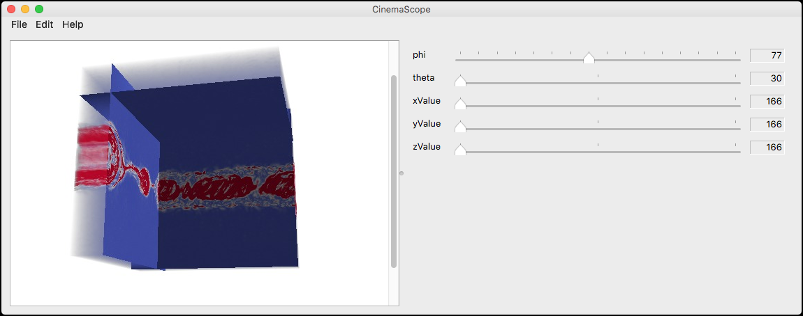

## Cinema Scope v0.1 cross-platform application

This is a cross-platform viewer for Cinema databases. The project contains a set of components for accessing and viewing databases which can be used to build other viewers and Cinema applications.

### Documentation 

Doxygen-generated documentation for the code is available [here](https://cinemascience.github.io/cinema_scope/html/index.html).

### Building the application

The application is built on the open source release of Qt, v5.12. To build:

1. Install [qt v5.12](https://www.qt.io/download) 
2. Run `qmake` on the `cinema_scope.pro` and (if you're doing development) for `cinema_scope_test.pro` for your specific OS and
development environment. Examples include:
    - OSX: `qmake cinema_scope.pro`
    - OSX (XCode): `qmake -spec macx-xcode cinema_scope.pro`
    - Linux: `qmake cinema_scope.pro`
3. You will now have makefiles, etc for your specific platform (assuming the
appropriate tools are installed). Edit the code and run `make` to create
executables. Build the `cinema_scope_test` project if you want to run unit tests.

## Settings

This application looks for a settings file at `$HOME/.cinema/scope/settings.ini` for an INI-style settings file.

## Contacts

Contact us at `cinema_dev@lanl.gov` with questions. Issues may be added to the
github project at: https://github.com/cinemascience/cinema_scope.
